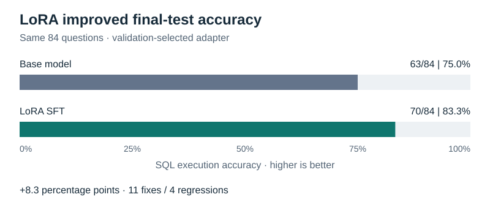

# CPU-Based LoRA Fine-Tuning for Text-to-SQL: An Empirical Case Study

A small, inspectable experiment in supervised fine-tuning: adapt **Qwen2.5-0.5B-Instruct** to generate SQLite queries, then compare it with the original model on the same held-out questions.

The study evaluates task-specific adaptation through reproducible data preparation, answer-only loss masking, LoRA updates, validation-based checkpoint selection, and execution-based evaluation. This is a controlled single-table task, not a production text-to-SQL system.

## Result



| Model | Correct test answers | Execution accuracy |
|---|---:|---:|
| Original model | 63/84 | 75.0% |
| Model + selected LoRA adapter | 70/84 | 83.3% |

The **8.3 percentage-point gain** comprised **11 fixes and 4 regressions**. Eight fixes learned the expected all-column output convention, three fixed a comparison condition, and four regressions reversed `<=` to `>=`. This is one training seed and one small templated dataset; it does not establish broad SQL reasoning improvement.

See [recorded experiments](results/README.md) for predictions, settings, intermediate runs, and failure analysis. The separate pilot improved from 38/42 to 41/42 after wording clarification without training. Do not compare the pilot score directly with the final test score: they contain different questions.

## Task and data

Given a database schema and an English request, generate one SQLite `SELECT` statement. The model generates **SQL, not the returned database rows**. For example:

> Request: Get orders with an amount greater than 100.
>
> Expected SQL: `SELECT * FROM orders WHERE amount > 100;`

The database represents fictional orders. `id` identifies an order, `country` is its country, and `amount` is its numeric value (no currency is specified). Both the questions and database rows are synthetic; there is no customer data or external text-to-SQL dataset.

```sql
CREATE TABLE orders (
    id INTEGER PRIMARY KEY,
    country TEXT,
    amount REAL
);
```

### Question families

These are seven **query families**, not classification labels the model must predict. The target is always SQL. The examples below illustrate each family's meaning; wording varies across splits. Every reference returns all three columns using `SELECT * FROM orders` followed by the condition shown.

| Family | Example request | SQL condition |
|---|---|---|
| `country_eq` | Get orders from France. | `WHERE country = 'France'` |
| `amount_gt` | Get orders with an amount greater than 100. | `WHERE amount > 100` |
| `amount_ge` | Return orders whose amount is at least 100. | `WHERE amount >= 100` |
| `amount_lt` | Find orders with amounts below 100. | `WHERE amount < 100` |
| `amount_le` | Find orders worth no more than 500. | `WHERE amount <= 500` |
| `country_amount_gt` | Find orders from France with amounts greater than 100. | `WHERE country = 'France' AND amount > 100` |
| `amount_range` | Find orders with amounts from 50 to 150, including both endpoints. | `WHERE amount >= 50 AND amount <= 150` |

Equality boundaries matter: an order worth exactly 100 belongs in `>= 100`, but not `> 100`. This dataset tests wording, comparison operators, and combining two conditions. It does **not** cover joins, aggregation, grouping, nested queries, or unfamiliar schemas.

### How the data is built and split

`prepare_data.py` combines hand-written wording templates with fixed country/amount pools, then samples deterministically using a fixed seed. Eight countries and eight single-threshold amounts are available; range endpoints use smaller lower/upper pools. Each question is paired with SQL and structured filter metadata.

| Split | Total | Per family | Purpose |
|---|---:|---:|---|
| Train | 196 | 28 | Update the LoRA weights using reference SQL answers |
| Validation | 56 | 8 | Measure loss without updating weights; select the best epoch |
| Test | 84 | 12 | Compare base and selected adapter using generated SQL execution |
| Pilot | 42 | 6 | Preliminary base-model evaluation and question-wording checks |

The pilot is **not training data**, and the test is not a time-based/out-of-time split. The eight-update training benchmark uses a small selection from **train**, not `pilot.jsonl`.

Different splits use different wording templates but the same schema, operations, and value pools. This measures limited phrasing generalization. Generated SQL references are checked against Python filtering on three fixtures, including boundary values. This verifies execution consistency; English template meaning still requires review.

The evaluator requires matching column names/order and unordered row multisets on all fixtures. It runs restricted SELECT queries with work/row limits. It does not repair outputs or remove Markdown fences. Sorting, joins, functions, and arbitrary SQL equivalence are outside this version's evaluation contract.

The model receives only the schema and question at inference. During training, the reference SQL is added as the assistant answer and only answer tokens contribute to loss. IDs, family labels, filter metadata, and database rows are not supplied as hidden hints.

See the [data file guide](data/README.md) for a sample record, every field's meaning, and how references are checked; see the [result file guide](results/README.md#what-each-file-means) for logs and reports. JSON and JSONL do not support comments, so their descriptions live in these adjacent guides rather than altering machine-readable evidence.

## Files to read

| File | Responsibility |
|---|---|
| `config.py` | Shared model revision, paths, prompt, CPU and generation settings |
| `prepare_data.py` | Deterministic JSONL data and SQLite fixture generation |
| `download_model.py` | Download the pinned snapshot and record/check file fingerprints |
| `train.py` | Eight-update benchmark or full SFT with validation and checkpoints |
| `evaluate.py` | Base or adapter inference and SQLite result scoring |
| `compare_results.py` | Check experiment parity and report paired fixes/regressions |
| `inspect_example.py` | Optional lesson: tokens, next-token targets, and loss masking |
| `run_base_example.py` | Optional lesson: one base-model answer |
| `test_*.py` | Data, evaluator, and training-input tests |
| `docs/` | Detailed benchmark and full-training walkthroughs |
| `data/` | Current reproducible synthetic datasets; generated fixtures are ignored by Git |
| `results/` | Recorded experiment evidence; binary checkpoints are ignored by Git |

The optional lessons are kept because this is a learning project. Core scripts import shared settings from `config.py`, not from those lessons.

## Reproduce on Windows CPU

Tested with **Python 3.12.10**, Windows, an Intel i7-1165G7, and 16 GB RAM. Commands below are PowerShell, run from the repository root. Internet is needed for packages and the approximately 1 GB model snapshot. No inference API, Hugging Face login, or GPU is required.

### 1. Create an environment and install pinned dependencies

```powershell
py -3.12 -m venv .venv
.venv\Scripts\python.exe -m pip install "torch==2.14.0+cpu" --index-url https://download.pytorch.org/whl/cpu
.venv\Scripts\python.exe -m pip install -r requirements.txt
```

`requirements.txt` pins the tested direct and transitive dependencies. CPU PyTorch comes from its official wheel index; install it first. These are Windows/CPU reproduction instructions, not a claim that the same wheel selection works on macOS. Other platforms may require their own PyTorch build.

### 2. Prepare data and download the pinned model

```powershell
.venv\Scripts\python.exe prepare_data.py
.venv\Scripts\python.exe download_model.py
```

`prepare_data.py` recreates only the project's generated datasets and three fixture databases. Do not manually edit those outputs; change the generator if starting a new data version.

Model revision: `7ae557604adf67be50417f59c2c2f167def9a775`. Hashes detect changes relative to the first locally recorded download manifest; they are not independent publisher signatures.

### 3. Test and optionally inspect an example

```powershell
$env:HF_HUB_OFFLINE = "1"
.venv\Scripts\python.exe -m unittest discover -v
.venv\Scripts\python.exe inspect_example.py
.venv\Scripts\python.exe run_base_example.py
```

The last two commands are optional. Tests need generated fixtures, installed packages, and the local tokenizer. Offline mode prevents model-hub network requests after download.

### 4. Benchmark, then train

```powershell
.venv\Scripts\python.exe train.py
.venv\Scripts\python.exe train.py --full --epochs 3
```

Both commands start from the original model with fresh adapters. Full training uses rank 8, alpha 16, query/value adapters, AdamW at 0.0001, batch size one, float32, and four CPU threads. All 196 examples appear once per shuffled epoch, yielding 588 updates across three epochs.

The default **eight-update benchmark** selects the longest tokenized training example from each of the seven families. It performs one warm-up update, then seven timed updates (the warm-up example is repeated). These are real gradient/optimizer updates on seven unique examples, not eight epochs. The first update is excluded from timing statistics, but still changes the adapters. The benchmark checks speed, memory, gradients, frozen weights, and adapter saving; it is not the final quality evaluation.

Python's built-in `argparse` reads the words after `train.py`: `--full` sets a Boolean switch and `--epochs 3` supplies an integer. The script calls `full_main(3)` when the switch is present, otherwise `benchmark_main()`. `--epochs` alone does not enable full training. Run `train.py --help` to see the options without training. See [training modes and arguments](docs/TRAINING_MODES.md) for the actual routing code.

Full training measures answer-token-weighted validation loss before training and after each epoch. It saves and verifies adapter checkpoints, selects the lowest-loss epoch, verifies frozen base weights, and reloads the selected adapter to reproduce its validation score. Checkpoints contain adapters, not optimizer state for exact resumption.

Our run took about 12.2 minutes including validation and verification, with approximately 3.16 GiB peak resident process memory. Runtime and scores can vary with hardware and libraries. Seeds and recorded settings support reproducibility, not guaranteed identical floating-point results everywhere.

### 5. Compare base and selected adapter on the test set

Replace `YOUR_TRAINING_RUN` with the folder printed by your training run, and replace `epoch_N` with its `training.json` field `best_checkpoint`. Do not automatically choose the last epoch.

```powershell
.venv\Scripts\python.exe evaluate.py --split test
.venv\Scripts\python.exe evaluate.py --split test --adapter "results/YOUR_TRAINING_RUN/epoch_N"
.venv\Scripts\python.exe compare_results.py "results/YOUR_BASE_TEST_RUN" "results/YOUR_LORA_TEST_RUN"
```

Each evaluator invocation prints its result directory. Supply those two directories to the comparison command. They must share data, prompt, generation settings, software versions, and evaluator hash. The comparison records fixes, regressions, and remaining failures, not just aggregate accuracy.

To inspect the initial development stage, `evaluate.py` defaults to the pilot split. Current data reproduces the clarified pilot. The earlier wording snapshot and original predictions are retained as historical evidence, not silently mixed into the current test.

## Experiment discipline and limitations

- The selected version 1 checkpoint was epoch 1; validation loss slightly worsened after further training.
- Validation loss uses reference-token prefixes. SQL evaluation generates without the reference answer. They answer different questions.
- The final test is now inspected. If its errors guide new training/data changes, reserve a fresh final test for that new experiment.
- Reference projection is always `SELECT *`; some natural-language questions do not explicitly specify columns. Part of the measured gain is learning that output convention.
- Multiple fixtures reduce accidental result matches but do not prove query equivalence on every possible database.
- LoRA reduces trainable parameter and optimizer storage, not all base-model computation.

## Local artifacts and documentation

`.venv/`, `models/`, Python caches, generated SQLite databases, and adapter checkpoint directories stay local and are excluded by `.gitignore`. They can be recreated by the commands above. The selected original adapter remains on the author's machine; a clone retrains its own adapter. Text evidence from the original experiments is retained, including historical machine paths and source hashes; those paths describe the original run and are not required on a new machine. Source hashes differ after this organizational cleanup.

Read [the training mechanics](docs/TRAINING_WALKTHROUGH.md) and [the full training loop](docs/FULL_TRAINING_WALKTHROUGH.md) for deeper explanations.

The downloaded model includes its upstream license. No license for this repository's code has been selected yet; choose one before presenting the repository as open-source software.
