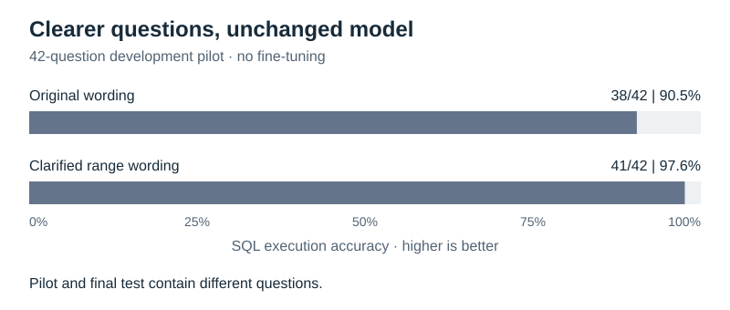

# Data file guide

These files are generated by `prepare_data.py`. Change the generator to create a new data version rather than manually editing its outputs. JSON is one structured document; JSONL is one complete JSON record per line. Neither supports comments. This guide supplies the descriptions without breaking readers or changing recorded fingerprints.

## One-line file descriptions

| File | Meaning |
|---|---|
| `train.jsonl` | 196 question/SQL pairs used to update LoRA weights. |
| `validation.jsonl` | 56 question/SQL pairs used to select the lowest-validation-loss checkpoint without weight updates. |
| `test.jsonl` | 84 question/SQL pairs used for the final paired base-versus-LoRA execution evaluation. |
| `pilot.jsonl` | 42 development questions used to inspect base-model behavior and clarify wording, not to train adapters. |
| `manifest.json` | Generation seed, schema, split sizes, query family names, and fixture filenames. |
| `fixtures/orders_boundaries.db` | 192 synthetic rows at, just below, and just above numeric thresholds across all eight countries. |
| `fixtures/orders_mixed.db` | 12 synthetic rows providing an additional mix of countries and amounts. |
| `fixtures/orders_sparse.db` | Eight synthetic rows providing a smaller alternative database for query checks. |

The three SQLite databases are evaluation/test fixtures, not three training splits. The same query is checked on all three. They are recreated locally and excluded from Git.

## What one record means

Here is an actual training record, expanded for readability (in JSONL it occupies one line):

```json
{
  "id": "train_amount_le_004",
  "split": "train",
  "query_family": "amount_le",
  "template_family": "train_no_more",
  "generalization_type": "training",
  "question": "Find orders worth no more than 500.",
  "schema": "CREATE TABLE orders (\n    id INTEGER PRIMARY KEY,\n    country TEXT,\n    amount REAL\n);",
  "sql": "SELECT * FROM orders WHERE amount <= 500;",
  "values": {"amount": 500},
  "components": {
    "table": "orders",
    "projection": ["*"],
    "filters": [{"column": "amount", "operator": "<=", "value": 500}],
    "connector": null
  }
}
```

| Field | Meaning |
|---|---|
| `id` | Unique example identifier for matching predictions and tracing failures. |
| `split` | Which dataset the example belongs to. |
| `query_family` | Logical operation category, such as amount less-than-or-equal. |
| `template_family` | Identifier of the English wording template used to create the question. |
| `generalization_type` | Intended role of the split, not proof of generalization. |
| `question` | English request supplied to the model. |
| `schema` | Table/column definitions supplied to the model. |
| `sql` | Reference answer used as the training target or evaluation reference. |
| `values` | Values substituted into the question and SQL templates. |
| `components` | Structured description of the expected table, output columns, and filters for checking/debugging. |

`projection: ["*"]` means return every column. `connector: null` means there is only one filter; multiple filters use `AND`. Family and component metadata are not included in the model prompt.

## Where the source of truth comes from

The source of truth is the hand-defined task specification: the templates, filter operators, and expected output columns. It is not a label supplied by SQLite or another LLM.

The generator renders SQL from those definitions. Tests separately load raw rows and filter them in Python using structured conditions, then compare the resulting row multisets with SQLite's SQL results. Golden examples and deliberately wrong query variants add checks for operators, boundaries, and missing conditions. This covers all 378 examples on three fixtures (1,134 comparisons).

This tests SQL/metadata agreement, but cannot independently prove that every English sentence communicates the intended condition. Both implementations could agree while a sentence remains ambiguous; the range-wording correction is why human review matters.

## What the pilot taught us about wording



Range questions were clarified to explicitly refer to order amounts and inclusive endpoints, while their intended SQL stayed unchanged. The improvement is a data-quality lesson, not a fine-tuning result. This development pilot contains different questions from the final test; its accuracy should not be joined to test accuracy as one improvement curve. See the [recorded wording analysis](../results/base_pilot_20260911T040037001999Z/interpretation.md).

## Scope of the split

Every split contains all seven families. Wording templates are split-specific, but schema, operations, and value pools are shared, and templates can be close paraphrases. This is a small phrasing-generalization experiment, not a test on unseen SQL capabilities. After using the final test's failures to guide future development, reserve a fresh final test.

For the seven families and examples, return to [Task and data](../README.md#task-and-data). The older files in `results/data_before_range_clarification_20260910/` have this same format but retain pre-clarification wording; they are historical evidence, not the active training data.
