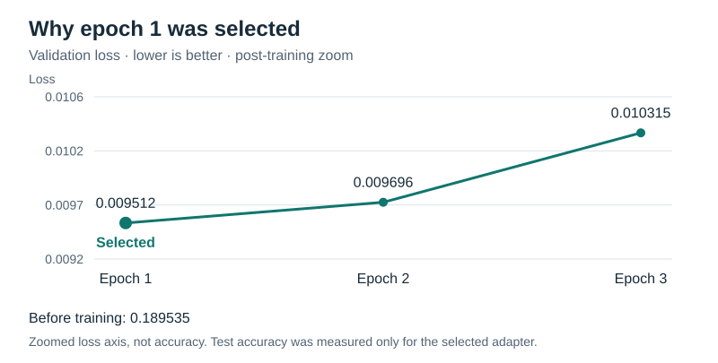
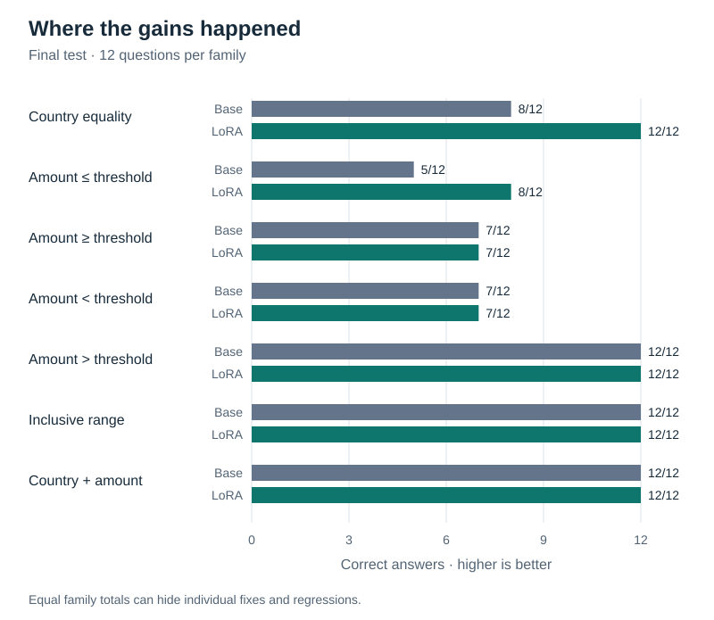

# Recorded experiments

Keep the experiment evidence separate from reproducible binary artifacts. The timestamped folders below contain original logs, predictions, metadata, and interpretations. Do not treat scores from different splits as a single improvement curve.

| Stage | Recorded result | Evidence |
|---|---|---|
| Original pilot | 38/42 | [Original pilot](base_pilot_20260904T235125761604Z/summary.json) |
| Clarified pilot | 41/42, unchanged model | [Wording analysis](base_pilot_20260911T040037001999Z/interpretation.md) |
| Short LoRA benchmark | Eight updates, median 1.40 seconds/update | [Benchmark](lora_benchmark_20260911T041959985110Z/benchmark.json) |
| Full SFT | Three epochs; epoch 1 selected | [Training report](sft_v1_20260923T045558219043Z/training.json) |
| Base test | 63/84, 75.0% | [Base summary](base_test_20260923T051755848526Z/summary.json) |
| LoRA test | 70/84, 83.3% | [LoRA summary](lora_test_20260923T052011979719Z/summary.json) |
| Paired comparison | 11 fixes, 4 regressions | [Comparison](lora_test_20260923T052011979719Z/comparison.json), [interpretation](lora_test_20260923T052011979719Z/interpretation.md) |

Each evaluation folder also includes `predictions.jsonl` and `run.json`. The training folder includes per-update and per-validation-example losses. These make the reported results auditable without retraining.

## Checkpoint selection: why epoch 1 won



Validation loss dropped sharply from the untrained baseline, then slightly increased after epoch 1 even as training loss continued to decrease. We selected epoch 1 using validation loss, not final-test accuracy. The chart zooms into the three post-training measurements; its vertical axis does not start at zero. We did not measure test execution accuracy for every epoch. Values come from the [training report](sft_v1_20260923T045558219043Z/training.json).

## Final-test performance by question family



Aggregate gains were concentrated in country equality and less-than-or-equal questions. Equal totals elsewhere do not imply identical predictions: the [paired comparison](lora_test_20260923T052011979719Z/comparison.json) records individual fixes and regressions. See the [interpretation](lora_test_20260923T052011979719Z/interpretation.md) for projection-convention fixes and remaining operator errors.

### Rebuild the README charts

The four static SVGs are stored under `docs/images/` and should be committed with the READMEs, so GitHub can display them without running code. Their numbers are read from the recorded v1 reports, not manually copied into image files. From the project root, regenerate them with:

```powershell
.venv\Scripts\python.exe docs/generate_charts.py
```

The generator uses only Python's standard library; it does not train or evaluate a model. Its run-folder constants intentionally identify the historical experiment rather than whichever run happens to be newest. The headline chart is in the [main README](../README.md#result), and the wording comparison is in the [data README](../data/README.md#what-the-pilot-taught-us-about-wording).

## What each file means

JSON and JSONL do not allow comments. These one-line descriptions cover repeated filenames across the experiment folders without modifying original evidence. A JSONL file has one record per line; a JSON file is one structured report.

| Filename / location | One-line description |
|---|---|
| Evaluation `run.json` | Model, prompt, decoding settings, software versions, and file fingerprints that identify the evaluation setup. |
| Evaluation `predictions.jsonl` | One question's raw model answer, reference SQL, execution checks, timing, and outcome per line. |
| Evaluation `summary.json` | Aggregate execution accuracy, exact-string matches, error counts, runtime, and scores by query family. |
| LoRA test `comparison.json` | Matched base/LoRA outcomes identifying fixes, regressions, shared successes, and shared failures. |
| Benchmark `benchmark.json` | Eight-update smoke-test settings, timing/memory, loss checks, verification results, and runtime estimate. |
| Benchmark `steps.jsonl` | One real optimizer update per line, including whether it was the warm-up update. |
| Full SFT `training.json` | Complete training settings, epoch-level losses, selected checkpoint, runtime, and integrity checks. |
| Full SFT `steps.jsonl` | One training update per line, recording the example, loss, and update diagnostics. |
| Full SFT `validation_before.json` | Per-example and aggregate validation losses before any full-run training. |
| Full SFT `validation_epoch_N.json` | Per-example and aggregate validation losses after epoch N, without validation weight updates. |
| Local `epoch_1/adapter_config.json` | PEFT configuration needed to reconstruct the selected LoRA adapters; weights live separately. |
| Archived data `*.jsonl` | Pre-clarification versions of the four splits, using the [same record format](../data/README.md). |
| Archived data `manifest.json` | Seed, schema, split sizes, families, and fixture names for the historical data snapshot. |

Start with `summary.json` for an evaluation result, `training.json` for training progress, and `comparison.json` to understand the net gain. Open `predictions.jsonl` only when you want individual examples.

### JSON files in the local model folder

These are library inputs, not experiment reports; do not add comment fields or change downloaded files. They stay outside Git.

| File under `models/qwen2.5-0.5b-instruct/` | One-line description |
|---|---|
| `config.json` | Base model architecture settings used to instantiate the network. |
| `generation_config.json` | Model-provided text-generation defaults; experiment decoding settings are explicitly recorded in each evaluation's `run.json`. |
| `tokenizer.json` | Serialized tokenizer rules and vocabulary used to convert text into token IDs and back. |
| `tokenizer_config.json` | Tokenizer settings, special-token definitions, and chat formatting information. |
| `vocab.json` | Mapping from vocabulary token strings to integer IDs. |
| `download_manifest.json` | Locally recorded model revision, file sizes, and SHA-256 fingerprints for detecting subsequent file changes. |

`data_before_range_clarification_20260910/` preserves the pre-clarification JSONL data. Its fixture databases were byte-identical to the current fixtures and have been removed as duplicates; regenerate the current fixtures using `prepare_data.py`. The retained historical manifest names those same fixtures.

Cleanup removed the unused benchmark adapter and non-selected epoch-2/epoch-3 adapter directories. Their measurements and selection evidence remain. The selected epoch-1 adapter is retained locally but excluded from Git along with all binary checkpoints. Re-running training creates new epoch checkpoints. Historical statements that all checkpoints were saved describe the original run, before cleanup.

Historical metadata includes original absolute paths and source fingerprints. These are provenance, not portable configuration. To reproduce the method on a new checkout, follow the root README and compare newly generated runs with each other.
